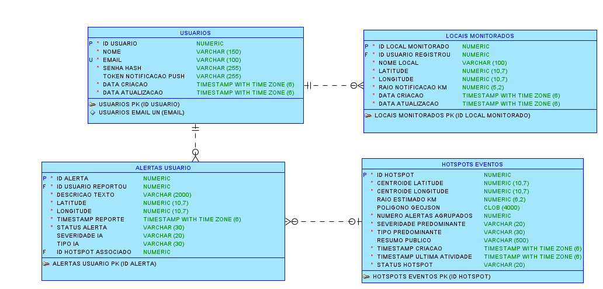
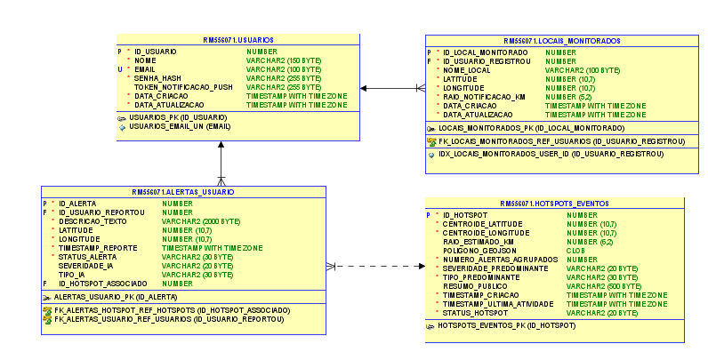

# 🚨 Projeto RedSignal

**Plataforma de Monitoramento de Enchentes e Deslizamentos**  
Projeto desenvolvido para a disciplina de **Advanced Business Development with .NET**, como parte do **Global Solution 2025/3° Semestre** da FIAP.

---

## 🎯 Contexto

O RedSignal nasce como uma resposta tecnológica ao desafio de eventos extremos da natureza, proposto pela FIAP no projeto Global Solution. O objetivo é mitigar os impactos de enchentes e deslizamentos em áreas urbanas, por meio de uma solução integrada que combina inteligência artificial, APIs REST, comunicação entre sistemas e uma interface administrativa para visualização de dados críticos.

A aplicação foi desenvolvida como uma API REST com interface administrativa, responsável por cadastrar, listar e gerenciar Locais Monitorados por usuários. A solução se integra à API Java (responsável por alertas) e à API Python (responsável por classificações via IA), possibilitando o envio de notificações personalizadas a usuários potencialmente afetados.

---

## 🔧 Tecnologias Utilizadas

- ASP.NET Core (.NET 6)
- Razor Pages + TagHelpers
- Entity Framework Core + Migrations
- Oracle Database (ou InMemory para testes)
- Swagger (documentação automática)
- Autenticação com Cookies (admin)
- Integração via API REST com backend Java

---

## 🗺️ Diagrama da Solução

Abaixo está o modelo lógico/relacional do sistema, que mostra os relacionamentos entre Usuários, Alertas, Locais Monitorados e Hotspots:

  

---

## 🛠️ Como Rodar o Projeto

### 1. Pré-requisitos

- .NET 6 SDK
- Oracle Database (ou usar InMemory para testes)
- Visual Studio 2022 ou VS Code
- Git

### 2. Clonar o repositório

bash
git clone https://github.com/BeatrizFerreira01/RedSignal-.NET.git
cd RedSignal-.NET

### 3. Rodar a aplicação

bash
dotnet build
dotnet run

Acesse o navegador:  
📍 http://localhost:5135/swagger

---

## 📘 Swagger

A documentação da API está disponível em:

📎 [http://localhost:5135/swagger](http://localhost:5135/swagger)

---

## 🔒 Login Administrativo

- Usuário: admin  
- Senha: admin123

Interface web: http://localhost:5135/Admin/MonitoredLocationsManager

---

## 🧠 Endpoints da API

### 🔹 Criar Local Monitorado
POST /api/v1/users/{userId}/monitored-locations

json
{
  "nomeLocal": "Ponte do Socorro",
  "latitude": -23.6,
  "longitude": -46.7,
  "raioNotificacaoKm": 1.5
}

---

### 🔹 Listar Locais Monitorados
GET /api/v1/users/{userId}/monitored-locations

---

### 🔹 Buscar Local Monitorado por ID
GET /api/v1/users/{userId}/monitored-locations/{locationId}

---

### 🔹 Atualizar Local Monitorado
PUT /api/v1/users/{userId}/monitored-locations/{locationId}

json
{
  "id": 1,
  "userId": 1,
  "nomeLocal": "Casa Reformada",
  "latitude": -23.61,
  "longitude": -46.71,
  "raioNotificacaoKm": 2.0,
  "dataCriacao": "2025-06-08T00:00:00Z",
  "dataAtualizacao": "2025-06-08T00:00:00Z"
}

---

### 🔹 Deletar Local Monitorado
DELETE /api/v1/users/{userId}/monitored-locations/{locationId}

---

### 🔹 Endpoint Interno (Java)
GET /api/v1/internal/monitored-locations/all-active

**Header obrigatório:**
X-Internal-Api-Key: SUA_CHAVE_INTERNA

---

## 🖼️ Interface Razor Pages

- /Admin/MonitoredLocationsManager/Index
- CRUD completo de locais monitorados com autenticação por cookie

---

## 🌐 Integração com a API Java

- A API Java identifica um novo alerta crítico ou hotspot.
- Ela chama GET /api/v1/internal/monitored-locations/all-active na API C#.
- A API C# retorna todos os locais monitorados ativos.
- A API Java calcula quais locais estão dentro do raio de risco.
- Se encontrar locais afetados, envia notificação push personalizada ao usuário.

---

## 🖥️ Estrutura de Pastas

| Pasta | Finalidade |
|:------|:-----------|
| Controllers | Contém os endpoints REST da API |
| Pages/Admin/ | Interface administrativa Razor Pages |
| Models/ | Entidades da aplicação |
| Services/ | Regras de negócio isoladas |
| Data/ | Contexto do banco de dados (EF Core) |
| Images | Imagens dos Diagramas |
| wwwroot/ | Arquivos estáticos da aplicação |

---

## ✅ Requisitos Atendidos

- [x] API REST com boas práticas
- [x] Banco relacional (Oracle ou InMemory)
- [x] Relacionamento 1:N (Usuário → Locais)
- [x] Documentação Swagger
- [x] Razor Pages + TagHelpers
- [x] Migrations (estrutura via EF Core)

---

## 👨‍💻 Desenvolvedores

- RM559177 - Amanda Mesquita Cirino da Silva  
- RM555698 - Beatriz Ferreira Cruz  
- RM556071 - Journey Tiago Lopes Ferreira

---

## 🎥 Pitch & Demonstração

- [🔗 Link para o vídeo Pitch (YouTube)](https://youtube.com/...)
- [🔗 Link para a Demonstração Completa (YouTube)](https://youtube.com/...)

---

## 📝 Observações Finais

Este projeto foi desenvolvido integrando múltiplas disciplinas e tecnologias com foco em:

- Segurança e usabilidade
- Arquitetura baseada em microsserviços
- Escalabilidade e integração entre APIs
- Aplicação real com dados geográficos e IA

---
